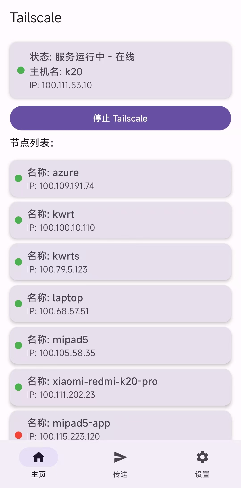
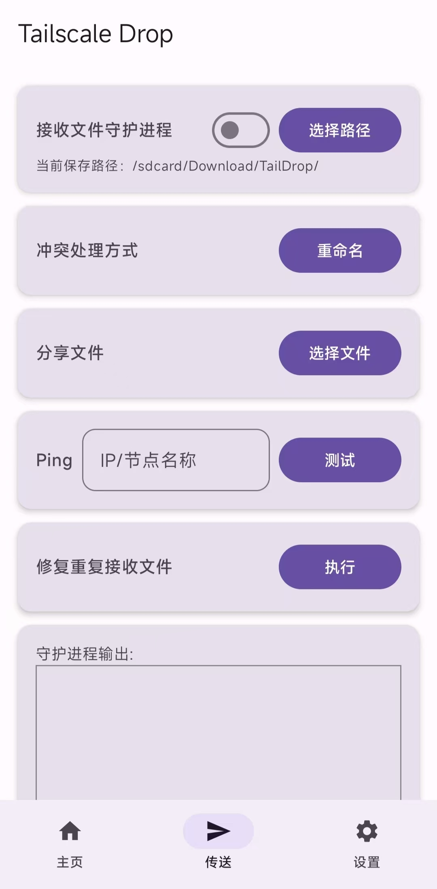
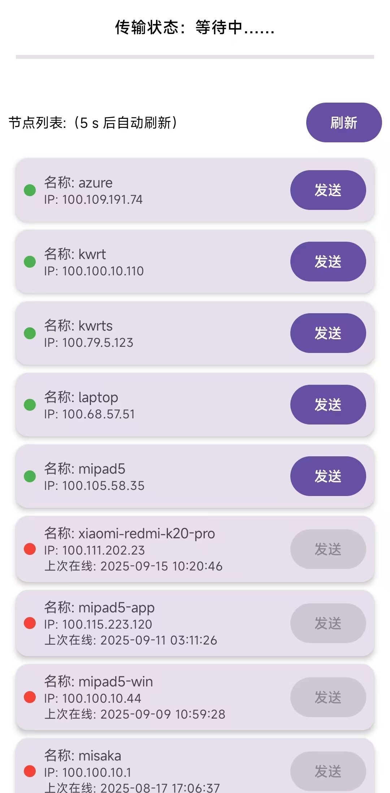
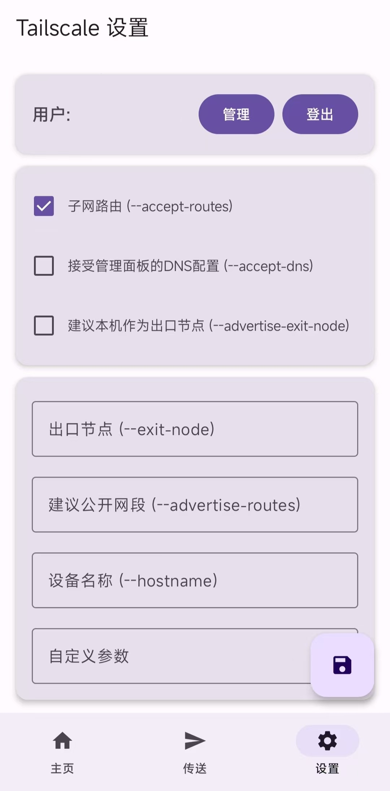

# Magisk-Tailscaled-GUI
简体中文 | [English](readme_en.md)

## 项目简介

Magisk-Tailscaled-GUI 是一个基于 Kotlin 开发的 Android 应用程序，为 Magisk-Tailscaled 提供图形化控制界面和 TailDrop 功能。由于本人没有安卓开发基础，该软件是在ChatGPT帮助下生成，可能存在不稳定性。

## 特点与功能

- **一键控制** - 快速启动/停止 Tailscale 服务和 Drop 服务
- **状态监控** - 实时显示本机和节点状态
- **文件传输** - 为Magisk-Tailscaled集成了方便的Drop功能
- **快捷设置** - 一键登录/登出，并提供了常见参数的开关以及自定义参数功能

### 计划中的功能
- 多文件发送

## 安装指南

### 前提条件

- 已 root 的 Android 设备
- 已安装 [anasfanani/Magisk-Tailscaled](https://github.com/anasfanani/Magisk-Tailscaled) 模块

### 安装步骤

1. 在 [Releases](https://github.com/ArchChen1/Magisk-Tailscaled-GUI/releases) 页面下载最新 APK
2. 安装 APK 文件
3. 授予 root 权限

## 预览截图

  
  
  
  

  <b>⭐ 如果这个项目对你有帮助，请给它一个 Star！</b>

## 更新日志

### v1.0.0 (2025-09-15)
- 初始版本发布

