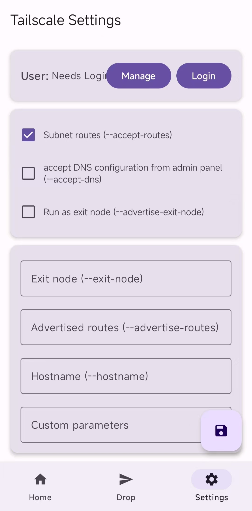

# Magisk-Tailscaled-GUI
[简体中文](readme.md) | English

This page was translated by ChatGPT 

## Project Introduction

Magisk-Tailscaled-GUI is an Android application written in Kotlin that provides a graphical interface for Magisk-Tailscaled and integrates the TailDrop feature.  
Since I have no prior Android-development experience, the vast majority of the code was generated by ChatGPT; therefore, instability may occur.

## Features

- **One-Tap Control** – Quickly start/stop the Tailscale service and Drop service  
- **Status Monitoring** – Real-time display of local-device and peer status  
- **File Transfer** – Convenient Drop functionality built on top of Magisk-Tailscaled  
- **Quick Settings** – One-click login/logout, common-parameter toggles, and custom-parameter support

### Known problem
- An exception may occur when launching the app for the first time after installation. Restart the app to resolve the issue.
- After version 2.0 of Anasfanani/Magisk-Tailscaled, the tailscale file command is no longer supported.

## Installation Guide

### Prerequisites

- A rooted Android device  
- [anasfanani/Magisk-Tailscaled](https://github.com/anasfanani/Magisk-Tailscaled) installed

### Steps

1. Download the latest APK from the [Releases](https://github.com/ArchChen1/Magisk-Tailscaled-GUI/releases) page  
2. Install the APK  
3. Grant root permission when prompted

## Preview Screenshots

  
  
  
  
  

  <b>⭐ If this project helps you, please give it a Star!</b>

## Changelog

### v1.0.0 (2025-09-15)
- Initial release
